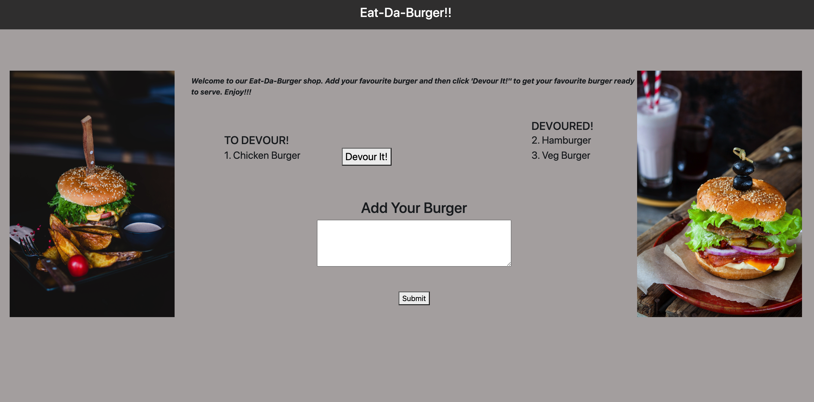

# Node Express Handlebars

### Overview

This assignment is used for creating a burger logger with MySQL, Node, Express, Handlebars and a homemade ORM (yum!). MVC design pattern is followed; Node and MySQL are used to query and route data in our app, and Handlebars to generate final HTML view.

### User Story 

```
AS A user, I want to be able to eat the burgers I like

I WANT to be able to submit a burger's name, that displays the burger on the left side of the page with `Devour it!` button

SO THAT I can get the burger `Devoured` by pressing the `Devour it!` button
```


### Prerequisite

To execute the burger application, the user must first install node.js.

Steps to Install NodeJS: [Node.js Installation](https://docs.npmjs.com/downloading-and-installing-node-js-and-npm#windows-node-version-managers)

After installing node.js

To install NPM module dependencies, run the command:

```
npm install
```

The application will be invoked with the following command:

```
npm start or node server.js
```

### NPM Module

* express - Express is a minimal and flexible Node.js web application framework that provides a robust set of features for web and mobile applications. Used express server for this project and also sets up the Express app to handle data parsing.

* mysql - Used mySQL method for connecting to the database and perform queries.

* express-handlebars - Used handlebars for separating layout and content. Its a view Engine.

### Database

   * Created the database `burgers_db`.
   * Switch to or use the `burgers_db`.
   * Create a `burgers` table with these fields:
     * **id**: an auto incrementing int that serves as the primary key.
     * **burger_name**: a string.
     * **devoured**: a boolean.

### Directory structure

The directory structure will be like:

```
.
├── config
│   ├── connection.js
│   └── orm.js
│ 
├── controllers
│   └── burgerController.js
│
├── db
│   ├── schema.sql
│   └── seed.sql
│
├── models
│   └── burger.js
│ 
├── node_modules
│ 
├── package.json
│
├── public
│   └── assets
│       ├── css
│       │   └── style.css
│       └── js
│           └── burgerHandleEvents.js
│   
│
├── server.js
│
└── views
    ├── index.handlebars
    └── layouts
    │    └── main.handlebars
    └── partials/burgers
        └── burger-block.handlebars
```  

### Challenges Faced

*  At first it's very difficult to understand/handle the routes, the flow and the callbacks. After working a lot and go through the class activities helped me to figure out.
*  The second thing is regarding the handlebars. To apply the styling for the page, to pass the data and make it work is real difficulty. After understanding the concepts in the site [Handlebars](https://handlebarsjs.com/guide/builtin-helpers.html) helped a lot.
*  While testing came to know that it is inserting empty data value even on not providing the burger name. With the help of learning Assisstants got that issue solved.

### Preview



### Submission Links

Link To the GitHub Repo : https://github.com/YakiniA/13-NodeExpress-Handlebars

Link To the deployed application on Heroku : https://evening-depths-68682.herokuapp.com/

#### References

Express Handlebars : [Handlebars](https://handlebarsjs.com/guide/builtin-helpers.html)<br/>

Stack Overflow : [Stack Overflow - $ not defined](https://stackoverflow.com/questions/2194992/jquery-is-not-defined)<br/>

Stack Overflow : [Stack Overflow - Bootstrap Entire Width problem](https://stackoverflow.com/questions/23156830/bootstrap-3-navbar-not-full-width)